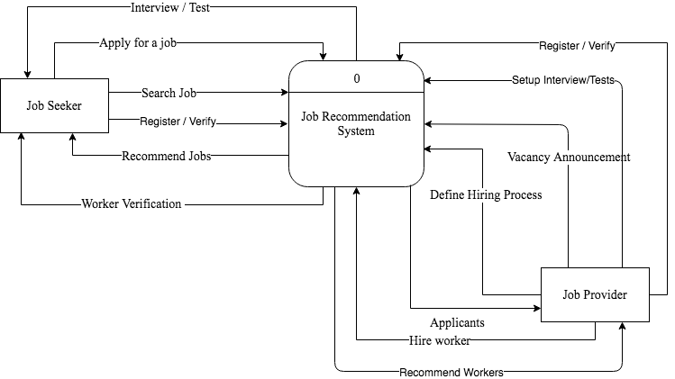

# FrameWork DFD

## External Entities

### 1. Job Providers

Job Providers open vacancy for which they want to hire and share them on the site.

#### List of Actions to The Systems

1. Open a Vacancy
2. List out Requirements
3. Hire Workers
4. Setup Interview/Tests

#### System Action to the Provider

1. Filter out workers according to requirements.
2. Recommend workers based on knowledge and skills.
3. Provide Platform to setup Tests/Interviews

### 2. Job Seekers

Job Seekers Seek jobs

#### List of Actions to The System

1. Search for Jobs
2. Apply for a Job
3. Acquire Skill
4. Finalize Job Post
5. Register and Fill out details
6. Give Tests/Interview

#### System Action to the Seeker

1. Recommend Jobs based on skills, search history, hobbies.
2. Platform for giving tests/interview.
3. Worker Verification 

## DFD

